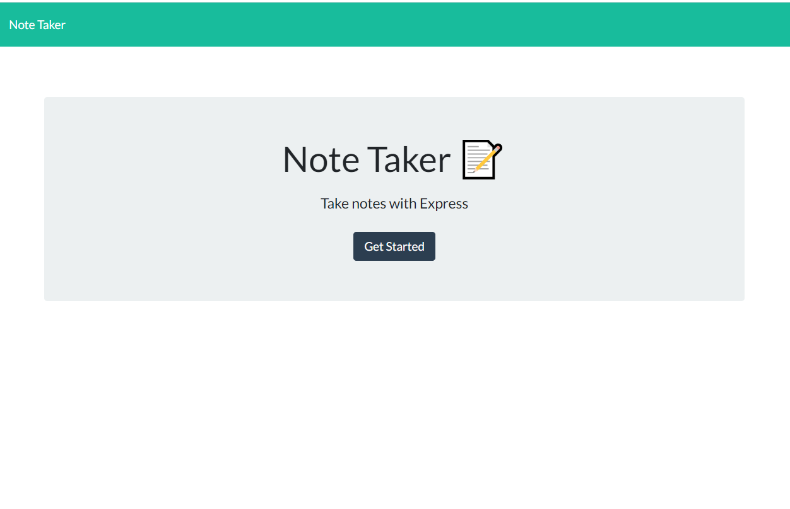
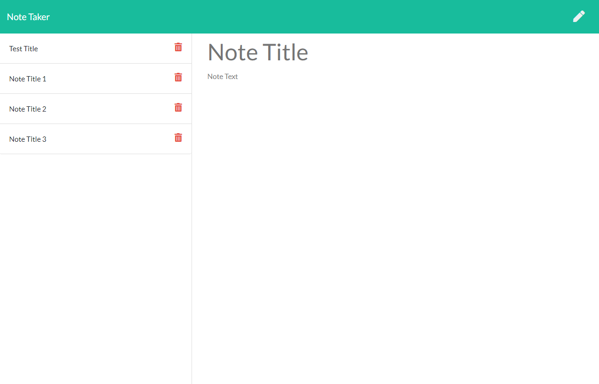

# Create Note Take
# using Express.js


## Description 📰
```md
Using Express.js this application provides an interface for a user to write and save
notes.  The user can see all notes on the left hand side fo the screen, can click on a note
to get more detail, can click on the trash can to delete a note, can click on the pencil to 
enter a new note, and then click on the diskette to save the note.
```

## Table of Contents 📚
- [Installation](#installation)
- [Usage](#usage)
- [Credits](#credits)
- [License](#license)
- [Badges](#badges)
- [Questions](#questions)
- [Tests](#tests)

## Installation 🚧
```md
The following steps should be used to install:
1. Download Repository from GitHub
2. Install NPM installer (if not already installed)
3. NPM install Express (if not already installed)
```

## Usage 🧮
node server.js





## Credits 👷
```md
Mark Harrison   
```

## License 📜
```md
ISC license
```

## Badges 🛡️
```md


```

## Questions 🔍
```md
:octocat: Follow me on GitHub: [MarkHatTHORinc](https://github.com/MarkHatTHORinc)
✉️ Contact me: markh@thorinc.com
```

## Tests  💻
```md
1. Download GitHub Repostory
2. Run the Application (node server.js)
4. Verify the Notes HTML page allows:
    1. A new note to be entered and saved
    2. New note appears in note list on left
    3. Note can be deleted.
```

Created by [Generator](_https://github.com/MarkHatTHORinc/09-NodeJS_) using _professional_ template. 